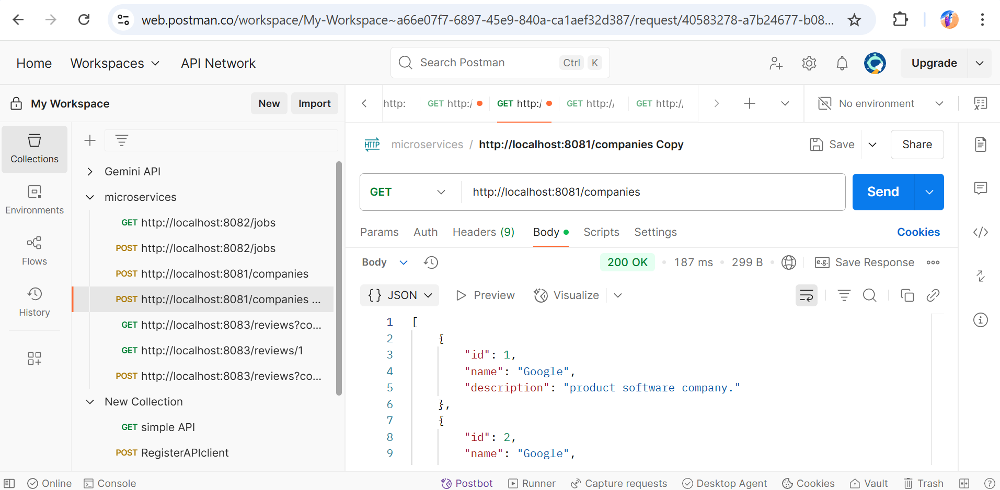
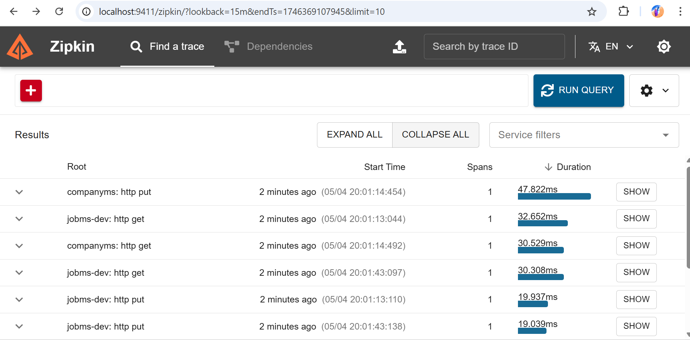

# 🧩 Microservices-Based Java Project

This repository showcases a modular Java-based microservices system using Spring Boot, focusing on core OOP concepts with Spring Boot in business logic. It features services for managing companies, jobs, and reviews, supported by Eureka discovery, centralized config, Docker-based infrastructure, and observability with Zipkin.

---
## 🖥️ Screenshots

### Microservice Implementation

### Zipkin 

---

## 🧱 Microservices Overview

| Service         | Description                                                                 |
|----------------|-----------------------------------------------------------------------------|
| `companyms`     | Manages company-related data.                                               |
| `jobms`         | Handles job listings and communicates with `companyms` via OpenFeign.       |
| `reviewms`      | Maintains company reviews and user feedback.                                |
| `configServer`  | Centralized configuration for all services.                                 |
| `server_reg`    | Eureka Server for service discovery.                                        |

---

## ⚙️ Tech Stack

- Java 17+
- Spring Boot
- Spring Cloud (Eureka, Config Server, OpenFeign)
- PostgreSQL
- Docker & Docker Compose
- pgAdmin
- Zipkin (for distributed tracing)

---

